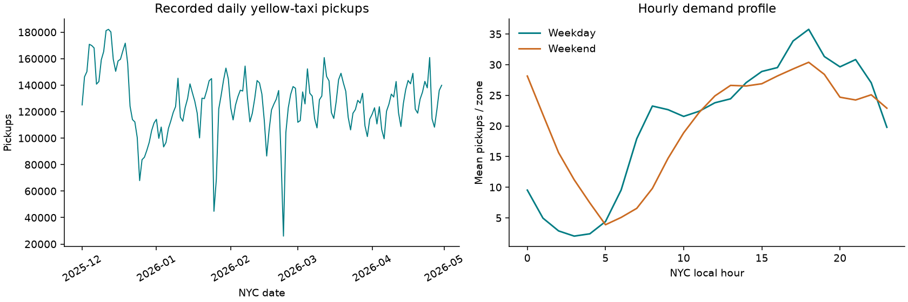
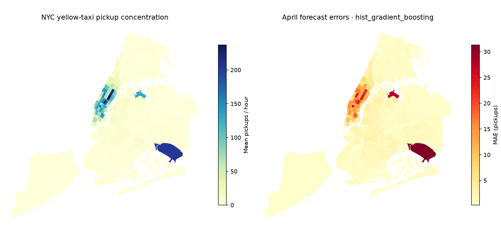

# NYC Mobility Intelligence

Predict recorded yellow-taxi pickups for every NYC Taxi Zone in the next hourly interval, using official TLC trip records. A Python forecasting system with reproducible acquisition, an audited hourly panel, leakage-tested temporal features, real baseline comparisons, geographic error analysis, and a local prediction API.

**Status:** active development, September 14–October 13, 2026. Initial working milestone prepared September 13. See [PROJECT_STATE.md](PROJECT_STATE.md) for verified results and [ROADMAP.md](ROADMAP.md) for remaining work. Expanding walk-forward comparison is implemented; bounded tuning, weather, interactive visualization, and operational monitoring remain open.

## Problem and scope

At the boundary of hour `t`, predict pickup count in `[t, t + 1 hour)` using completed observations through `[t - 1 hour, t)`. Every feature uses only earlier observations or calendar information known at prediction time. Evaluation advances one hour at a time with observed history, not recursively predicted history.

The initial population is **yellow-taxi recorded pickups**, not all NYC transportation, unmet rider demand, or a live dispatch service. All 262 NYC Taxi Zones are included, including zero-demand hours. Newark Airport and unknown/outside-NYC IDs are excluded. Yellow-taxi coverage is concentrated in Manhattan and airport activity; sparse-zone accuracy needs separate scrutiny.

## Reproduce

Install [uv](https://docs.astral.sh/uv/getting-started/installation/) and Git, then:

```bash
git clone https://github.com/gitLamHoang/nyc-mobility-intelligence.git
cd nyc-mobility-intelligence
uv sync --frozen --python 3.12
uv run python scripts/download_data.py --start 2025-12 --end 2026-05
uv run nyc-mobility prepare
OMP_NUM_THREADS=4 OPENBLAS_NUM_THREADS=4 uv run nyc-mobility train
uv run nyc-mobility report
uv run pytest
uv run ruff check .
uv run ruff format --check .
```

`uv run nyc-mobility all` executes the four pipeline stages. Downloads are cached and verified with SHA-256. Reserve about 2 GB disk for raw data, aggregates, predictions and model artifacts, plus environment space; training can use several GB of RAM. No raw trip files, processed Parquet, or model pickle files are committed. The exact dependency graph is in `uv.lock`.

Run `uv run nyc-mobility audit-quality` after preparation for an optional development-only exact-duplicate and reporting-volume audit. It verifies source hashes and compares an alternate count policy without changing the canonical target or model. The [September 14 review](reports/DATA_QUALITY_REVIEW.md) found no exact duplicates in 19.18 million eligible December–April pickups; it documents reporting anomalies and why they are retained.

Run the separate development backtest after preparation:

```bash
OMP_NUM_THREADS=4 OPENBLAS_NUM_THREADS=4 uv run nyc-mobility backtest
# Use the backtest ID printed by the preceding command:
uv run python scripts/plot_backtest.py reports/backtests/<backtest-id>
```

The [frozen protocol](docs/WALK_FORWARD_PROTOCOL.md) compares ten candidates across February, March and April, refitting each pipeline on expanding historical training data. It saves immutable scores and daily errors under `reports/backtests/`, and ignored forecast tables under `artifacts/backtests/`. It leaves the existing API artifact and April experiment unchanged. The `all` command retains its original four stages; it does not launch the backtest.

## Data and evaluation contract

Official TLC yellow-taxi files: **December 2025–May 2026**. This is the latest consecutive six-month period listed on the official TLC page when initialized. The source files, content hashes, download timestamps, and sizes are recorded in [data_manifest.json](reports/data_manifest.json). The dataset contains **23,304,288 raw records** and **23,263,775 accepted NYC pickups**, forming **1,144,154 zone-hours**.

| Partition | NYC local target times (end exclusive) | Purpose |
|---|---|---|
| Train | Dec 1, 2025–Apr 1, 2026 | Fit parameters; first 168 hours used for warm-up |
| Validation | Apr 1–May 1, 2026 | Compare fixed baselines and classical models |
| Test | May 1–Jun 1, 2026 | Sealed until the model-selection protocol is frozen |

Internally, `hour` is UTC and local calendar features use `America/New_York`. The spring DST day contains 23 real hours. The pipeline rejects fall-back ranges because TLC local timestamps do not identify which repeated hour a pickup belongs to. Lag 24/168 means **elapsed hours**, which can differ from local clock-time matching around DST.

TLC files arrive with a publication delay. This retrospective experiment assumes complete previous-hour pickup counts at the forecast boundary. Real deployment requires a timely observation feed and latency sensitivity evaluation. Zeros assume an available month's absence of records means no recorded pickups; vendor outages and duplicate reporting cannot yet be distinguished from true demand changes. Fares, distance, passenger count, and drop-off outcomes are audited but do not filter pickup counts or enter features.

## Models and evidence

Five baselines: previous hour, previous 24 hours, previous 168 hours, a training-only zone/hour average, and a rolling 24-hour mean. Classical comparisons: linear regression, Ridge, and histogram gradient boosting. Boosting uses a fixed iteration budget without random internal early-stopping validation. Zone IDs are one-hot encoded, not treated as a numeric rank.

MAE is the primary selection metric; RMSE, R², and zero-safe SMAPE are also recorded. All zone-hours receive equal metric weight. Slice reports expose low-demand zones and concentration of errors. No test score is reported during model development.

See [latest experiment](reports/latest_experiment.json), immutable [experiment records](reports/experiments/), [data quality](reports/data_quality.json), and [error slices](reports/error_slices.csv).

Initial measured April validation (188,640 zone-hours):

| Model | MAE | RMSE | R² | SMAPE % |
|---|---:|---:|---:|---:|
| Previous hour | 5.586 | 16.829 | 0.914 | 61.65 |
| Previous day (24h) | 6.330 | 22.496 | 0.847 | 61.91 |
| Previous week (168h) | 4.305 | 13.014 | 0.949 | 57.40 |
| Training zone/hour average | 6.155 | 20.271 | 0.876 | 99.43 |
| Rolling 24h mean | 12.199 | 35.654 | 0.616 | 100.24 |
| Linear regression | 4.148 | 11.571 | 0.960 | 73.23 |
| Ridge | 4.151 | 11.575 | 0.960 | 73.73 |
| Histogram gradient boosting | **3.480** | **9.700** | **0.972** | 104.05 |

Boosting reduces MAE by **19.2%** against the strongest baseline (previous week), but its SMAPE is substantially worse. Small positive predictions in zero/low-demand hours warrant targeted review. This single validation month does not establish statistical significance or performance in other seasons. Test results are not available yet.

The [September 17 walk-forward review](reports/WALK_FORWARD_REVIEW.md) extends development evaluation to **559,370 February–April zone-hours**. Squared-error boosting leads in every month: pooled MAE **3.693** versus **5.104** for the weekly baseline, a **27.65% reduction**. Poisson and absolute-error losses improve sparse-zone MAE but worsen overall MAE and RMSE. Squared-error boosting remains worse than the weekly baseline on sparse-zone MAE in every fold. These dependent development comparisons do not establish statistical significance, and May remains sealed. Full evidence is in [latest_backtest.json](reports/latest_backtest.json).






## Prediction API

Train first, then run:

```bash
uv run uvicorn nyc_mobility.api.app:app --host 127.0.0.1 --port 8000
```

Open `http://127.0.0.1:8000/docs` for the request schema. `GET /health` reports loaded model metadata. `POST /predict` accepts one NYC `zone_id` and 168–744 hourly observations, each with an explicit UTC offset and a nonnegative integer `demand`. It returns the immediately following target interval and a nonnegative expected pickup count. Missing hours, duplicates, unknown zones, and targets inside the training period fail validation. A request-generation script and smoke test are in `scripts/smoke_api.py`.

The current artifact serves the lowest-MAE classical model from the initial April comparison; the metadata also records the overall champion including baselines. This distinction matters if a baseline wins. Development backtests do not automatically replace the serving model. Only trusted local model artifacts should be loaded. The API is a local prototype: public hosting, authentication, operational observation ingestion, and monitoring are not yet implemented.

## Architecture

```text
Official TLC Parquet + zone lookup + zone boundaries
  -> cached acquisition and source manifest
  -> DuckDB schema/quality checks + hourly pickup counts
  -> complete UTC zone-hour panel (Parquet)
  -> past-only features + chronological partitions
  -> five baselines + linear/Ridge/gradient boosting
  -> immutable experiment metrics + validation error maps
  -> shared feature transformation + local FastAPI inference
```

`src/nyc_mobility/` contains reusable modules; `scripts/` supplies convenient entry points. Tests use clearly artificial fixtures only to verify behavior; published project observations and scores come from official data. An empty notebook directory is intentionally omitted: reproducible analysis currently lives in executable reporting code.

## Attribution and limitations

Data: [NYC TLC Trip Record Data](https://www.nyc.gov/site/tlc/about/tlc-trip-record-data.page), [yellow-taxi dictionary](https://www.nyc.gov/assets/tlc/downloads/pdf/data_dictionary_trip_records_yellow.pdf), and official Taxi Zone lookup/boundaries linked from TLC. TLC cautions that vendor-submitted records are not guaranteed accurate. See [data/README.md](data/README.md) for filtering, provenance, storage, and source terms. Source code uses the [MIT license](LICENSE); third-party data retains its own terms.

Six months do not capture a full annual cycle. Reported patterns are descriptive, not causal. Weather improvements will be measured rather than assumed. The held-out test remains available for one final evaluation after development is frozen.
