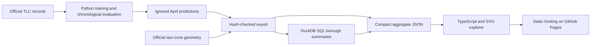

# Demand explorer: from experiment to an inspectable product

[Open the explorer](https://gitlamhoang.github.io/nyc-mobility-intelligence/) · [Export evidence](../reports/demo_export.json) · [Source study](../reports/BOROUGH_REVIEW.md)

The intended user is a mobility analyst comparing where demand concentrates and where a forecast fails. The current prototype supports that inspection; interviews, adoption and operational value have **not** been validated. It forecasts recorded yellow-taxi pickups, not unmet passenger demand.

## Try it in one minute

1. Move the hour slider from midday to the evening peak.
2. Choose a borough and a neighborhood using the selectors or map.
3. Compare the temporal model, borough-context candidate and previous-week baseline.
4. Switch to forecast-error shading and inspect the selected zone's 48-hour trace.

The map uses **April 7–8, 2026, New York time**, with 12,576 zone-hours across 262 zones. It is a historical validation demo, not a live prediction service. The metrics above the map describe only the selected hour and borough. The two-day window was selected for demonstration after evaluation and is not a representative performance estimate. Full February–April results are linked separately.

## Run without downloading trip records

Requires Node.js 24.12 or later. The compact, aggregated demo snapshot is committed, so a reviewer can run it without Python, API keys, model files or raw trips:

```bash
cd web
npm ci
npm test
npm run dev
# Production bundle:
npm run build
```

The browser validates the schema, aligned zone/hour dimensions and finite nonnegative counts before displaying anything. TypeScript tests exercise invalid data and filter/MAE aggregation, and Python tests reconcile the snapshot with the tracked hashes and borough SQL summaries. A keyboard-accessible zone selector provides the same selection behavior as the map. GitHub Actions tests and builds the public site before Pages deployment.

## Data path and technology choices



- **Python** owns preparation, fitting, integrity checks and immutable experiments.
- **SQL** performs reproducible borough aggregation in `sql/demo_summary.sql`.
- **TypeScript** validates the public contract, filters observations, computes view-level summaries and updates the interface.
- **CSS/SVG** provide a responsive geographic view without a mapping-service token or heavyweight map runtime.

`uv run python scripts/export_demo.py` regenerates the snapshot **only when the original ignored April predictions and audited geometry are present**. It rejects a prediction or geometry hash mismatch. A fresh checkout can run the demo, but cannot regenerate historical predictions simply from the snapshot; see the study's reproduction prerequisites. The output records study, forecast, geometry and SQL hashes. Exactly 495,546 bytes are exported; no individual trip rows are published. Geometry is simplified by 80 source feet (about 24 m) for display. Its historical availability is not established, so it is used only for visualization, not silently added as a model predictor.

## Capacity and the next product test

Static assets and a roughly 496 KB snapshot allow hosting/CDN infrastructure to serve independent readers without a model process or database per visitor. This is an architectural property, **not a measured traffic or load-test claim**. Rendering all historical zone-hours into one JSON file would not scale: extend the date range with versioned daily shards, lazy loading and a bounded cache. The existing local FastAPI inference path remains separate from this static demo.

The next product experiment is to observe an analyst using this view to identify a forecast failure, record whether they can explain it, and compare that task with reading a table. A useful success criterion would be correct interpretation and completion time; no interview or result is claimed here. Before any operational deployment, validate live-feed latency, service ownership, geographic coverage, monitoring and the cost of wrong forecasts. Current evidence shows small aggregate gains can coexist with worse sparse-zone errors.
