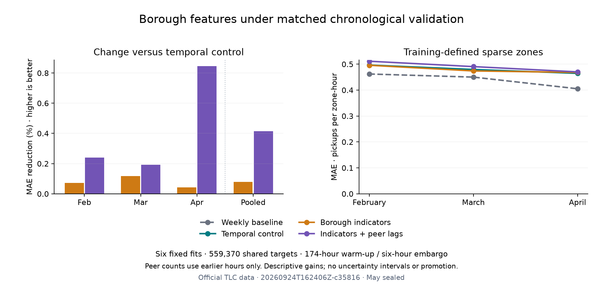

# Borough feature ablation: small aggregate gains, weaker sparse forecasts

Executed September 24, 2026 (America/Los_Angeles), run
`20260924T162406Z-c35816`. The [protocol](../docs/BOROUGH_SPATIAL_PROTOCOL.md) and
[configuration](../configs/borough_spatial.toml) were committed in `b92b982`
before fitting and remain byte-identical. Exactly **six fits** were completed:
two feature bundles × three expanding chronological folds. No search expansion,
control refits, serving promotion or May evaluation.

## Measured results

All eight candidates/controls cover the same **559,370** February–April targets.
Positive MAE reduction below means improvement against the matched temporal
histogram model, not the original April-only serving experiment.

| Model | Pooled MAE | MAE reduction vs temporal | RMSE | R² | SMAPE % |
|---|---:|---:|---:|---:|---:|
| Weekly baseline | 5.104228 | — | 16.261698 | 0.916936 | 60.553689 |
| Temporal histogram control | 3.695750 | — | 10.278490 | 0.966815 | 102.528315 |
| Temporal + borough indicators | 3.692830 | 0.079024% | 10.284075 | 0.966779 | 102.450129 |
| Temporal + indicators + peer lags | **3.680385** | **0.415762%** | **10.240313** | **0.967061** | 101.773706 |

Static indicators reduce MAE only **0.00292055** pickups per zone-hour and worsen
RMSE slightly. Zone identity already implies borough membership; this is a change
in representation, not new geographic information. Adding mean other-zone borough
demand at lags 1/24 reduces MAE another **0.01244498** (0.337004% versus static).
The total reduction versus temporal is **0.01536553**. These are descriptive point
estimates; no uncertainty interval for this ablation has been computed.

| Validation month | Temporal MAE | Indicators MAE | Indicators + peer lags MAE | Peer bundle reduction vs temporal |
|---|---:|---:|---:|---:|
| February | 3.741904 | 3.739220 | 3.732908 | 0.240424% |
| March | 3.853552 | 3.849039 | 3.846113 | 0.193040% |
| April | 3.489830 | 3.488333 | 3.460341 | 0.845022% |

Every aggregate MAE contrast has the same direction across months, with the
largest peer-demand gain in April. The existing temporal XGBoost depth-6 result
still has lower pooled MAE (3.667507), but its RMSE is higher (10.334616).
That is context from [the prior study](XGBOOST_REVIEW.md), not an additional fit,
formal contrast or serving-selection decision in this six-fit experiment.



## The sparse-demand limitation persists

Sparse zones are defined only from each fold's training mean (≤1 pickup/hour).
There are 91 such zones per fold. The peer-demand bundle **worsens sparse-zone
MAE against both temporal and static models in every month**, and all three
boosting variants lose to the weekly baseline on sparse MAE:

| Month | Weekly | Temporal | Indicators | Indicators + peer lags |
|---|---:|---:|---:|---:|
| February | 0.462062 | 0.496590 | 0.495762 | 0.511337 |
| March | 0.450091 | 0.479521 | 0.473915 | 0.490597 |
| April | 0.405143 | 0.464560 | 0.468223 | 0.470215 |

The peer bundle also worsens zero-target MAE versus temporal in every fold:
0.616146 → 0.637387, 0.572195 → 0.589035 and 0.550836 → 0.553512. SMAPE improves
slightly overall but remains much worse than the weekly baseline. Consequently,
the hypothesis that borough demand context resolves sparse/zero-demand errors
fails on these observed slices; an aggregate gain is not uniform improvement.

Geographic effects vary. Peer context lowers MAE in the Bronx, Manhattan and
Staten Island in all three folds; Brooklyn is slightly worse in February/March
and better in April. Queens is slightly worse in February and better afterward.
Staten Island peer-bundle MAE (0.207114 / 0.197742 / 0.203140) still greatly exceeds
weekly (0.058929 / 0.062450 / 0.038889). Full borough, hour, weekend/rush-hour,
sparse/dense and zero/positive slices are published without selective omission.

## What was held fixed

The original 18 zone/temporal inputs remain identical. Append only five borough
indicators for the static bundle, then the two declared past-only peer means for
the context bundle. The peer average excludes the focal zone. The lookup's
recorded February 2024 Last-Modified timestamp is the declared availability
evidence, not an independently archived historical download. No polygon, area,
centroid, weather, diagnostic peer-count or contemporaneous-demand column enters
the models. The [historical geometry mapping issue](SPATIAL_PREPARATION_REVIEW.md)
remains unresolved.

Each fold uses a fresh copy of the original histogram pipeline: dense zone
one-hot encoding, unscaled numeric passthrough, squared-error loss, 120 trees,
learning rate 0.08, 31 leaves, L2=1, 255 bins and seed 42; no early stopping.
Actual transformed matrices are **float64**, with widths **284/286** for the
static/context bundles. Per-fit resolved estimator parameters, preprocessing
parameters, input dtypes and transformed column order are recorded.

Training expands from December 1 with the control's 174-hour warm-up and
six-hour training-label embargo. Training row counts are 342,696 / 518,760 /
713,426. Validation has 176,064 / 194,666 / 188,640 rows, including March's 743
elapsed hours. All source hashes, training signatures, target keys/labels,
training-defined cohorts and saved control metrics pass before the first fit.
At hour t, completed observations through t−1 are assumed available. This is a
retrospective one-step experiment, not a live TLC feed.

## Execution and reproduction

The actual stage saves eight pooled scores, 24 fold scores, 12 descriptive
contrast rows, 888 slices, and **712 daily/model errors** (89 NYC dates × eight
models). Three full forecast tables remain ignored. The six fit/predict timings
sum to **107.957405585 seconds** locally with four OpenMP/BLAS threads; this is
not total end-to-end runtime or a cross-machine benchmark.

After canonical data preparation and restoration of the three pinned ignored
zero-delay control tables from latency run `20260921T021023Z-588968`:

```bash
OMP_NUM_THREADS=4 OPENBLAS_NUM_THREADS=4 uv run nyc-mobility borough
uv run python scripts/verify_borough.py reports/borough/<run-id>
uv run python scripts/plot_borough.py reports/borough/<run-id>
uv run pytest
uv run ruff check .
uv run ruff format --check .
```

Do not rerun fitting merely to regenerate figures or verify scores. The verifier
uses saved forecasts and controls; the plot uses tracked reports alone. Missing
or changed inputs fail rather than silently regenerating controls. A fresh
checkout cannot reproduce this exact comparison from tracked files alone until
the ignored original controls/data are restored. Portable control reconstruction
remains a documented hardening item.

[Verification](borough/20260924T162406Z-c35816/verification.json) checks 14 existing
data/model/evidence/lock files unchanged; every saved control forecast and target
matches exactly. It independently recomputes all pooled/fold MAE and RMSE values
(maximum discrepancy **3.552713678800501e-15**) and all 712 daily errors and row
counts, without fitting. The [run record](borough/20260924T162406Z-c35816/metrics.json)
contains exact sources/inputs, prediction hashes, resolved representations and
null test metrics. Its dirty-worktree flag is intentional; source hashes identify
the executed implementation relative to the parent revision.

All **189 tests** pass (610 dependency warnings), including 23 new budget,
representation, preprocessing-isolation, source-integrity and held-out-exclusion
tests. Shared control checks were extracted without changing the XGBoost path;
its existing tests pass. Ruff, actual study, independent verifier and visually
inspected plot pass. No new dependencies or serving artifacts.

## Decision and next action

Retain both candidates as development evidence, with no promotion or tuning
expansion. The aggregate gain does not resolve sparse-zone harm or establish
future superiority. Next execute the separately frozen paired uncertainty plan
for all three declared MAE contrasts from the saved daily errors, without fits.
Then audit authoritative NOAA hourly weather coverage and availability before
freezing any weather ablation. Keep May sealed until the October model freeze.
