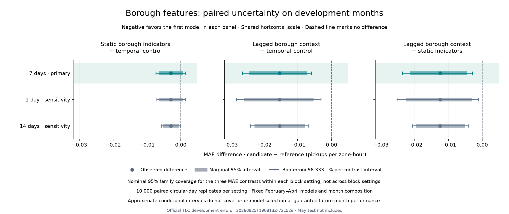

# Borough uncertainty review · September 25, 2026

Lagged borough demand retains a small aggregate MAE gain under every declared block setting. Static borough indicators alone do **not** have a clearly directional effect in the primary seven-day analysis. Neither result resolves the sparse/zero-demand harm reported in the [feature ablation](BOROUGH_REVIEW.md); the serving model is unchanged.

## Fixed follow-up, not another model search

The [protocol](../docs/BOROUGH_UNCERTAINTY_PROTOCOL.md) and [configuration](../configs/borough_uncertainty.toml) were committed in `20ff2b8` before resampling. The point estimates were already visible. Run [`20260925T190813Z-72c52e`](borough_uncertainty/20260925T190813Z-72c52e/metrics.json) uses only two hash-pinned public inputs from the borough experiment: its metrics and 712 daily/model MAE summaries. They cover eight models, 89 NYC dates and 559,370 February–April zone-hours per model.

For each 7-day primary / 1-day and 14-day sensitivity setting, 10,000 circular-day replicates preserve monthly strata and share sampled dates across every model. Sampled error totals are divided by sampled row counts; the March 8 DST day carries 6,026 rows per model, versus 6,288 on ordinary days. The original temporal features, 174-hour warm-up, six-hour label embargo, zero-delay assumption and training populations are unchanged. No models were fitted and no target Parquet or model artifact was loaded for inference or resampling.

## Primary results

Differences are candidate minus reference; negative values favor the candidate. Absolute intervals below use Bonferroni allocation across **all three predeclared contrasts**: 98.333333…% per contrast, for a nominal 95% family within a block setting. MAE units are pickups per zone-hour.

| Contrast | Observed MAE difference | Primary adjusted interval | Observed relative reduction |
|---|---:|---:|---:|
| Static indicators − temporal | −0.002921 | [−0.007356, +0.001293] | 0.079024% |
| Context bundle − temporal | −0.015366 | [−0.026430, −0.006036] | 0.415762% |
| Context bundle − static indicators | −0.012445 | [−0.023611, −0.002951] | 0.337004% |

The marginal 95% **relative** interval for context versus temporal is [0.196302%, 0.658885%]. It is not part of the adjusted absolute-difference family. [The complete table](borough_uncertainty/20260925T190813Z-72c52e/comparison.csv) retains all nine rows, full-precision endpoints and nominal levels; none are selected out after seeing their sign.



## Sensitivities and failed hypotheses

Both context contrasts retain negative adjusted endpoints under 1- and 14-day blocks. Static indicators' adjusted interval crosses zero under both the primary seven-day and the one-day settings, but is slightly negative under fourteen-day blocks ([−0.005685, −0.000134]). The effect is therefore sensitive to the chosen dependence assumption. Do not elevate the fourteen-day result over the predeclared primary analysis.

The hypothesis that static borough indicators provide a clearly directional primary aggregate benefit is not supported by this interval. The earlier hypothesis that peer context resolves sparse-demand weakness also remains unsupported: sparse-zone and zero-target MAE worsen versus temporal in every fold. Aggregate uncertainty does not establish a subgroup benefit, operational usefulness, or a justified serving-model promotion.

These are approximate conditional bootstrap intervals for fixed fitted models and observed months. Short 28–31-day strata, artificial wraparound, omitted cross-month dependence, and prior development selection limit their interpretation. Bonferroni allocation does not fix bootstrap calibration or cover all prior model comparisons, different block settings, relative metrics, future months, or individual forecasts. No May evaluation or automatic promotion occurred.

## Reproduce and verify

A fresh checkout needs only the locked Python environment and tracked files for the analysis and plot; raw trips, original model files and ignored borough forecast tables are not required:

```bash
uv sync --frozen --python 3.12
uv run nyc-mobility borough-uncertainty
# Replace <run-id> with the newly printed identifier:
uv run python scripts/verify_borough_uncertainty.py reports/borough_uncertainty/<run-id>
uv run python scripts/plot_borough_uncertainty.py reports/borough_uncertainty/<run-id>
```

The new ignored `artifacts/borough_uncertainty/<run-id>/draws.npz` is required by the verifier; it is produced by the first command. Verification does not recreate any historical fits. It independently recomputes all point estimates and percentile endpoints from saved draws, checks provenance and CSV agreement, and runs the analysis in an isolated temporary directory with only source, configs, lock and the two tracked input summaries. Every comparison and every draw array reproduced exactly; the comparison CSV was byte-identical. Maximum independent endpoint discrepancy was `8.326672684688674e-17`.

[Verification evidence](borough_uncertainty/20260925T190813Z-72c52e/verification.json) also records 19 preserved data/model/evidence/lock/protocol/demo files. The preservation audit hashes file bytes without interpreting held-out targets. The pure family-interval helper was moved into the shared uncertainty module with unchanged arithmetic and compatible XGBoost imports; old XGBoost tests still pass. New tests cover three-contrast arithmetic, a repeated candidate with distinct references, deterministic paired draws, invalid family/coverage inputs, no-fit/no-target access, and mid-run input/protocol/source/lock changes. **213 tests pass**, as do Ruff, the actual analysis, verification and visually inspected plotting. No dependencies were added.

Next: acquire and audit authoritative NOAA hourly weather, explicitly recording observation timestamps, quality flags, coverage, revision/availability limits and usable lags before defining a weather-model protocol. Do not add borough fits or open May to resolve uncertainty.
