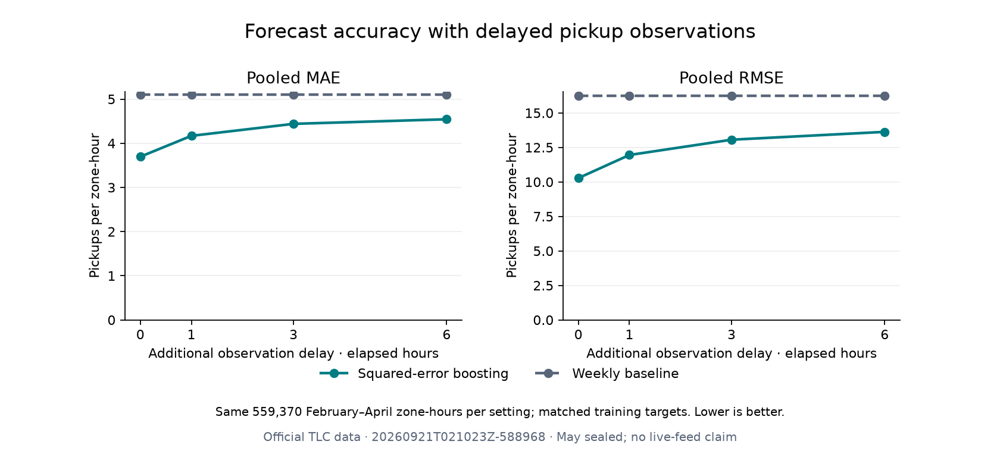

# Observation-latency sensitivity · September 20, 2026

**Recent data availability materially affects accuracy.** Relative to the matched zero-delay control, pooled MAE increases **12.78%, 20.13% and 22.94%** when counts arrive one, three and six additional hours late. Even after fitting a separate model for each delay, accuracy deteriorates in all three validation months. At six hours, boosting still reduces pooled MAE by **10.99%** against the weekly baseline, compared with **27.59%** at zero delay.

Run: `20260921T021023Z-588968` (UTC identifier; September 20 in America/Los_Angeles). The [protocol](../docs/LATENCY_PROTOCOL.md) and [configuration](../configs/latency.toml) were frozen September 19 in [`59e6f1f`](https://github.com/gitLamHoang/nyc-mobility-intelligence/commit/59e6f1f99401319f765171471cf3f5ae1c5b59a6), before this implementation and execution. The study used exactly twelve model fits and five baselines per setting/fold. No tuning, anomaly exclusions, new feature family or May evaluation was introduced.

## What the delay means

At forecast target hour `t`, an additional delay `d` makes the newest available count `y[t − 1 − d]`. The first three recent-count features and all trailing means/standard deviations move back accordingly. The recent trend uses the latest two available observations. Calendar features still describe target `t`. Target-anchored 24- and 168-hour lags stay unchanged, because those counts are available under every tested delay.

The implementation does not shift a completed feature row, replace missing recent counts with future observations, or move the forecast target. Every setting fits a fresh squared-error histogram-boosting pipeline using the same frozen parameters. This measures adaptation to a known fixed delay; it does not measure applying the original model unchanged to suddenly stale inputs.

## Matched training and evaluation

All settings use 174 elapsed hours of feature warm-up and exclude the six hours immediately before each validation month from training labels. This keeps the training targets identical and available even at the largest delay. Earlier observations from those six hours can still be used as validation features when a setting's availability permits them.

| Validation fold | Training rows per setting | Validation hours | Validation rows per setting |
|---|---:|---:|---:|
| February | 342,696 | 672 | 176,064 |
| March | 518,760 | 743 | 194,666 |
| April | 713,426 | 720 | 188,640 |
| Pooled validation | — | 2,135 | **559,370** |

Training begins December 8, 2025 at 06:00 NYC time and ends six elapsed hours before each fold's local-midnight validation boundary, exclusive. All 262 zones and every original validation hour remain present, including March's DST transition and the audited February low-volume event. Training-target hashes match across delays, and the exact target/zone/cohort keys agree in all four settings.

The zero-delay model here has fewer training rows than the original September 17 backtest. Its pooled MAE is 3.69575 rather than 3.69295. Delay effects therefore use this study's **matched zero-delay control**, not the older metric. The original API artifact was preserved and still reproduces all original April predictions exactly.

## Measured results

All metrics weight zone-hours equally and are recomputed from concatenated predictions rather than averaging monthly RMSE or R².

| Additional delay | Pooled MAE | RMSE | R² | SMAPE % | MAE increase vs control | MAE reduction vs weekly |
|---|---:|---:|---:|---:|---:|---:|
| 0 hours | 3.69575 | 10.27849 | 0.96682 | 102.53 | 0.00% | 27.59% |
| 1 hour | 4.16821 | 11.95184 | 0.95513 | 103.07 | 12.78% | 18.34% |
| 3 hours | 4.43988 | 13.05921 | 0.94643 | 103.69 | 20.13% | 13.02% |
| 6 hours | 4.54341 | 13.62837 | 0.94166 | 104.11 | 22.94% | 10.99% |



| Additional delay | February model MAE | March model MAE | April model MAE |
|---|---:|---:|---:|
| 0 hours | 3.74190 | 3.85355 | 3.48983 |
| 1 hour | 4.39019 | 4.33777 | 3.78604 |
| 3 hours | 4.79999 | 4.60642 | 3.93191 |
| 6 hours | 5.00050 | 4.66986 | 3.98632 |

The six-hour MAE increase is 33.64% in February, 21.18% in March and 14.23% in April. The study establishes this temporal variation but does not isolate its causes. Every delayed model still beats the weekly baseline in each fold on MAE.

Baseline pooled MAEs expose how much the unadjusted latest-count heuristic suffers:

| Baseline | 0 hours | 1 hour | 3 hours | 6 hours |
|---|---:|---:|---:|---:|
| Latest available count | 5.61256 | 8.51419 | 13.32592 | 18.72680 |
| Previous day, target-anchored | 6.75536 | 6.75536 | 6.75536 | 6.75536 |
| Previous week, target-anchored | 5.10423 | 5.10423 | 5.10423 | 5.10423 |
| Shared-training zone/hour mean | 6.58791 | 6.58791 | 6.58791 | 6.58791 |
| Delayed trailing 24-hour mean | 12.18516 | 12.26971 | 12.38398 | 12.45784 |

The weekly baseline is the strongest baseline in every setting and fold. Its invariance, along with the previous-day and zone/hour baselines, provides an additional check that the target calendar and common training labels have not shifted. Complete baseline RMSE, R² and SMAPE are published in the machine-readable results.

## Sparse zones and geography

The shared training mean defines 91 sparse zones per fold, using the existing threshold of at most one pickup/hour. Model MAE within that cohort is:

| Additional delay | Sparse February | Sparse March | Sparse April |
|---|---:|---:|---:|
| 0 hours | 0.49659 | 0.47952 | 0.46456 |
| 1 hour | 0.52252 | 0.51821 | 0.50634 |
| 3 hours | 0.54278 | 0.53078 | 0.51705 |
| 6 hours | 0.54592 | 0.51726 | 0.50593 |

Every delayed setting has worse sparse-zone MAE than zero delay, but deterioration is not monotonic in every slice. This study does not resolve the previously observed sparse-zone weakness or poor SMAPE.

The effect also extends to busy zones. April Manhattan MAE increases from 9.36591 at zero delay to 10.94165 at six hours; Queens increases from 1.92209 to 2.05239. Staten Island moves from 0.22930 to 0.29438, retaining negative R². All boroughs, local hours, weekend/rush-hour flags, sparse/dense cohorts and zero/positive targets are available in the [slice table](latency/20260921T021023Z-588968/slice_metrics.csv).

## Reproduction and verification

```bash
OMP_NUM_THREADS=4 OPENBLAS_NUM_THREADS=4 uv run nyc-mobility latency
uv run python scripts/plot_latency.py reports/latency/<latency-id>
uv run pytest
uv run ruff check .
uv run ruff format --check .
```

- [Immutable provenance](latency/20260921T021023Z-588968/metrics.json) records effective lag offsets, training/validation boundaries, label arrival times, target hashes, model parameters, fitting times and source/protocol/data/lock hashes. The recorded Git revision is the prior committed state; source hashes identify the executed implementation from its dirty worktree.
- [Pooled metrics](latency/20260921T021023Z-588968/pooled_metrics.csv), [fold metrics](latency/20260921T021023Z-588968/fold_metrics.csv), [delay effects](latency/20260921T021023Z-588968/delay_effects.csv), [slices](latency/20260921T021023Z-588968/slice_metrics.csv) and [2,136 daily summaries](latency/20260921T021023Z-588968/daily_mae.csv) include every prescribed setting. Large forecast tables stay outside Git.
- [Verification evidence](latency/20260921T021023Z-588968/verification.json) confirms eight existing data/model/evidence files remain byte-identical; all source/protocol/lock hashes match; training and validation coverage is shared; invariant baselines agree; and daily weighted MAEs reproduce pooled scores. March 8 has 6,026 rows per model/setting.
- Before fitting, zero-delay features matched the original builder exactly across **903,638 development rows**, and the preserved model reproduced all **188,640 original April predictions** exactly without refitting. The shared feature change therefore preserves current API behavior.
- **105 tests pass**, covering unavailable-tail perturbations, delayed window boundaries, seasonal lags, DST calendars, shared training labels, independent fits, held-out exclusion and artifact preservation. Ruff passes. The actual twelve-fit study and plotting script completed, and the figure was visually inspected.

## Decision and limits

Treat observation freshness as part of the forecast contract, not a deployment detail to postpone. The immediate-history model's advantage shrinks substantially when recent counts are withheld. Future model comparisons must state their availability assumptions and preserve the matched delay sensitivity as a reference.

These fixed retrospective delays do not model late revisions, intermittent outages, variable vendor delays, fitting/serving compute latency or an actual live data feed. Six hours is still far shorter than TLC's monthly publication process. Each case refits to its known delay; it is not evidence that the current API can safely accept stale observations. No delayed model has been promoted, the original serving artifact remains unchanged, and May stays sealed. No new confidence intervals or generalization claims are made for these delay effects.

Next: freeze a small XGBoost comparison budget against the established boosting and weekly references, with explicit common data availability and training coverage. Keep the operational data-feed limitation visible; a larger model alone cannot solve it. Spatial/weather ablations and the final held-out test remain later milestones.
