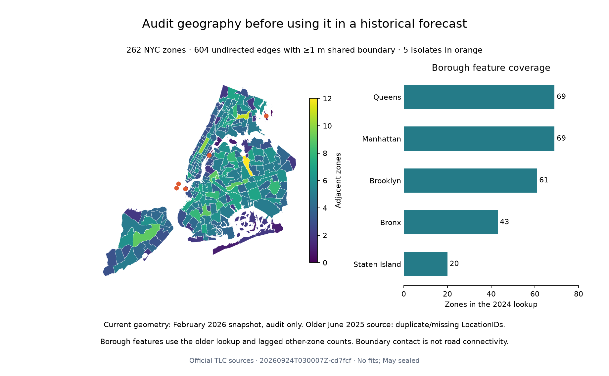

# Spatial source audit and borough feature preparation

Executed September 23, 2026 (America/Los_Angeles), run
`20260924T030007Z-cd7fcf`. This is a real-data preparation and validity milestone:
**zero model fits and no new predictive-performance claim**. The six-fit
[borough ablation protocol](../docs/BOROUGH_SPATIAL_PROTOCOL.md) is frozen for
subsequent implementation and execution. May and the serving model are unchanged.

## Historical geometry failed the eligibility check

Official provenance alone does not establish that a geometry snapshot or its ID
mapping was available at every historical forecast origin. We compared the cached
[TLC boundary ZIP](https://d37ci6vzurychx.cloudfront.net/misc/taxi_zones.zip) with
the older [NYC Open Data Taxi Zones release](https://data.cityofnewyork.us/api/views/8meu-9t5y.json).
The latter's exact GeoJSON endpoint and all four asset hashes are pinned in
[spatial_inputs.toml](../configs/spatial_inputs.toml).

| Source | Observed date evidence | ID audit | Decision |
|---|---|---|---|
| TLC boundary ZIP | HTTP Last-Modified February 19, 2026; ZIP members dated February 18, 2026 | 263 rows, 263 unique IDs; all 262 NYC IDs covered | Current descriptive geography only; availability before December 2025 unverified |
| NYC Open Data `8meu-9t5y` | Metadata publication June 9, 2025, 17:12:33 UTC; rows updated 11 seconds earlier | 263 rows but 260 unique IDs; ID 56 appears twice, 103 three times; 57/104/105 absent | Cannot join polygons one-to-one to the complete pickup-ID panel |
| TLC zone lookup | Recorded HTTP Last-Modified February 22, 2024, 21:33 UTC | 262 unique NYC IDs across five boroughs | Use borough labels with this declared availability assumption |

The HTTP headers are preserved in [the original manifest](data_manifest.json).
They are evidence about the retrieved source, not independently archived
historical downloads. The Open Data dates come from the pinned metadata response.
Both geometry sources have valid, nonempty polygons, so a validity-only check
would miss the identity issue. Newark ID 1 is present in both geometry assets and
is excluded from the NYC graph and forecasts.

The planned hypothesis that the older official release could directly support a
complete historical neighbor graph failed its ID check. We do not infer a
historical correspondence from row order, OBJECTID, names, centroids or current
geometry. Polygon adjacency, area and centroid predictors remain ineligible for
the complete December–April modeling window until that mapping is verified.
Existing descriptive maps show the retrieved geometry and do not establish its
historical feature availability.

## Current topology, measured without model scores

The current file is EPSG:2263 with US survey feet; convert using 1200/3937 meters
per coordinate unit. We inspect intersecting unordered pairs, reject invalid,
empty, duplicate-ID or borough-mismatched inputs, and reject pair overlap above
1 m². We do not snap, repair or dissolve polygons. Shared boundary of at least
1 meter defines an undirected audit edge; point contacts are excluded.

- 262 NYC nodes; 648 intersecting pairs; **604 qualifying edges**; maximum degree 12.
- Five isolates: IDs **46, 103, 104, 105, 202** (City Island, the three
  Governor's/Ellis/Liberty Island IDs, and Roosevelt Island).
- Largest pair overlap: **0.06823328217081989 m²**, below the declared tolerance.
- IDs 11 and 14 share **0.635754538796321 meters**, excluded by the one-meter rule.

These thresholds are geometric audit rules chosen without fitting, not travel
distance or road connectivity. Islands are not automatically connected across
water; bridges and ferries would require separate data and justification.



## Past-only borough features, executed on real counts

The separate `spatial-prepare` stage reads only December 1, 2025 through April 30,
2026 in NYC local dates, with the May exclusion pushed into the Parquet read.
It verifies the complete requested window and every zone's peer coverage.
It emits five borough indicators and two lagged mean-demand columns. At target
t, the latter average **other** zones in the same borough at t−1 and t−24 elapsed
hours. The focal zone is excluded; missing peers fail instead of becoming zero.
The library also supports the already-tested 1/3/6-hour availability delays.

Measured coverage: Bronx 43 zones, Brooklyn 61, Manhattan 69, Queens 69 and Staten
Island 20. The ignored feature table contains **949,226** December–April rows,
with **905,210** complete rows after the original 168-hour temporal warm-up.
Complete targets begin December 8 at 05:00 UTC and end May 1 at 03:00 UTC
(April 30, 23:00 NYC). Every existing temporal column matches exactly.

The forthcoming comparison will retain the stricter matched-control 174-hour
warm-up and six-hour training embargo. A no-fit preflight confirmed identical
training signatures, sparse cohorts, validation keys/labels and control scores
for all **559,370** February–April targets. Training rows remain
342,696 / 518,760 / 713,426; validation rows 176,064 / 194,666 / 188,640.
The context features introduce no additional target loss.

Direct other-zone group means at February 23 14:00 UTC and March 8 07:00 UTC
matched all **1,048** checked feature values exactly, including the DST day.
All prepared feature values after warm-up are finite. Repeated preparation
produced a byte-identical feature table. This demonstrates construction and
coverage, not improved forecasts; borough indicators may be redundant with zone
identity, and pooled peer demand may add no predictive value.

## Reproduce and verify

After the original download/preparation stages:

```bash
uv run nyc-mobility spatial-prepare
uv run python scripts/plot_spatial_audit.py reports/spatial_preparation/<run-id>
uv run pytest
uv run ruff check .
uv run ruff format --check .
```

Missing spatial assets are fetched from the pinned official URLs. A changed hash
fails before preparation; existing cached files are not overwritten. Mutable
Open Data metadata or GeoJSON ordering may prevent an exact future re-download.
Reproducing this exact audit requires the pinned bytes; acquisition/versioning
must be reviewed explicitly if upstream responses change. Raw geometry, metadata
and the full feature table stay outside Git. The plot needs the pinned ZIP;
the numeric audit tables and summaries are published.

[Metrics/provenance](spatial_preparation/20260924T030007Z-cd7fcf/metrics.json)
record exact inputs, coordinate units, UTC boundaries, versions, source/lock
hashes and zero fits. The parent Git revision predates the new implementation;
the dirty-worktree flag is intentional, with executed source hashes recorded.
[Verification](spatial_preparation/20260924T030007Z-cd7fcf/verification.json)
records the control checks, exact spot checks, repeated-table hash and **13
unchanged** existing data/model/evidence/lock files. The suite has **166 passing
tests** (367 dependency warnings); Ruff and the actual stage/plot pass, and the
figure was visually inspected. Artificial test fixtures test failure contracts;
they are not observations or forecasting results.

Next: implement and execute only the frozen two-bundle, six-fit borough ablation.
Any polygon-based modeling waits for verified historical zone correspondence.
