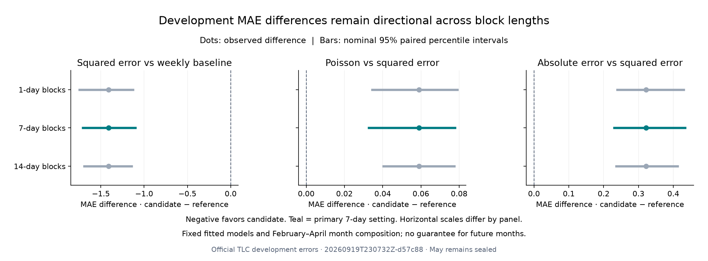

# Paired development uncertainty · September 19, 2026

**The observed model ordering persists under all three prespecified block lengths.** Squared-error boosting's 27.65% pooled MAE reduction versus the weekly baseline has a nominal 95% seven-day block-bootstrap interval of **22.63%–31.93%**. Poisson and absolute-error boosting retain higher overall MAE than squared-error boosting. These are conditional resampling results for existing February–April forecasts, not guarantees for future months or evidence that sparse-zone weaknesses are solved.

Run: `20260919T230732Z-d57c88`. The [protocol](../docs/UNCERTAINTY_PROTOCOL.md) and [configuration](../configs/uncertainty.toml) were frozen in commit [`4ee6c4b`](https://github.com/gitLamHoang/nyc-mobility-intelligence/commit/4ee6c4b0103ea14894836350c468b41f5df4ab0b) before calculating intervals. Point estimates were already known from the [walk-forward study](WALK_FORWARD_REVIEW.md).

## Method and primary results

The analysis reuses all 890 saved date/model MAE summaries: 89 NYC dates, ten models and 559,370 zone-hours per model. It resamples circular blocks of whole days within each monthly fold. Every model shares the same sampled days, preserving pairing and dependence among the zones and hours within a day. Monthly strata are sampled independently and retain their original numbers of days.

Daily error totals are daily MAE multiplied by the number of zone-hours. Each replicate divides total sampled error by total sampled zone-hours, so the 23-hour March 8 day retains 6,026 rows rather than the ordinary 6,288. Models are never refitted. No trip, forecast or held-out Parquet table is read by this stage.

The primary setting uses seven-day blocks and 10,000 replicates; the fixed one- and fourteen-day sensitivities each use another 10,000. Intervals are the linearly interpolated 2.5th and 97.5th percentiles. MAE difference is **candidate minus reference**, so negative favors the candidate. Relative reduction is **100 × (1 − candidate/reference)**, so positive favors the candidate.

| Candidate vs reference | MAE difference | Nominal 95% interval | Relative reduction | Nominal 95% interval |
|---|---:|---:|---:|---:|
| Squared error vs weekly baseline | −1.41128 | [−1.72317, −1.08715] | 27.65% | [22.63%, 31.93%] |
| Poisson vs squared error | +0.05898 | [+0.03209, +0.07835] | −1.60% | [−2.11%, −0.87%] |
| Absolute error vs squared error | +0.32140 | [+0.22708, +0.43708] | −8.70% | [−11.81%, −6.17%] |

## Block-length sensitivity

All intervals below are for the MAE difference, in pickups per zone-hour. The observed differences remain the same in every row; only the resampling distribution changes.

| Block length | Squared error vs weekly | Poisson vs squared error | Absolute error vs squared error |
|---|---:|---:|---:|
| 1 day | [−1.75917, −1.11662] | [+0.03385, +0.07964] | [+0.23540, +0.43309] |
| **7 days · primary** | **[−1.72317, −1.08715]** | **[+0.03209, +0.07835]** | **[+0.22708, +0.43708]** |
| 14 days | [−1.70410, −1.13080] | [+0.03974, +0.07814] | [+0.23328, +0.41507] |



None of these marginal intervals crosses zero, so the direction of each comparison is stable under these settings. This is not an unqualified significance claim. There are three comparisons without simultaneous-coverage correction, the development ranking had already been inspected, and the folds share training history.

Longer blocks do not produce monotonically wider intervals here. With only 28–31 dates per stratum, fourteen-day sampling has roughly two or three drawn blocks per month before truncation. Circular wrapping also creates artificial adjacency from the month's end to its beginning. Block-length sensitivity is useful evidence about this resampling procedure, not a coverage guarantee.

## What this establishes and leaves open

The comparison supports retaining squared-error boosting as the current overall development leader under the frozen temporal feature set and immediate prior-hour availability assumption. The alternative losses' improved sparse-zone MAE still comes with a larger citywide MAE, as documented in the earlier review. This analysis adds no sparse-zone confidence intervals and does not select a new model.

These intervals condition on fixed fitted models and the observed monthly composition. They omit training uncertainty, selection effects, new seasons, data revisions and observation latency. Monthly resampling omits dependence across fold boundaries and assumes sufficiently comparable error behavior within each month. They are not per-forecast prediction intervals or probabilities that a model is best. The May test remains sealed.

The next experiment addresses observation latency before increasing the model-search budget. Its [frozen protocol](../docs/LATENCY_PROTOCOL.md) varies which historical counts are actually available, retains target-time calendar information, and uses matched training/validation coverage for every setting. The latency experiment has **not** been executed yet.

## Reproduction and verification

```bash
uv run nyc-mobility uncertainty
uv run python scripts/plot_uncertainty.py reports/uncertainty/<uncertainty-id>
uv run pytest
uv run ruff check .
uv run ruff format --check .
```

The immutable source summaries are already in Git, so uncertainty reproduction does not require raw taxi files or trained models. Input hashes are pinned by the protocol. The stage rejects incomplete dates/models, duplicates, held-out dates, invalid errors, incorrect DST weights, inconsistent fold/pooled MAEs and altered source files.

- [Machine-readable comparison](uncertainty/20260919T230732Z-d57c88/comparison.csv) contains all nine intervals and the relative-reduction sensitivities.
- [Run provenance](uncertainty/20260919T230732Z-d57c88/metrics.json) records inputs, source/protocol/lock hashes, seed, method and exact results. The Git revision identifies the protocol commit; the dirty-worktree flag and source hashes capture the newly implemented runner. Full replicate arrays remain ignored under `artifacts/uncertainty/`.
- [Verification](uncertainty/20260919T230732Z-d57c88/verification.json) confirms all recorded hashes match and seven existing data/model/evidence files are unchanged. There were zero new model fits and no May evaluation.
- All **84 behavioral tests** pass, including paired sampling, circular wrap/truncation, unequal day weights, seed reproducibility, percentile arithmetic, input integrity and output isolation. Ruff passes. The real uncertainty stage and plotting script completed, and the rendered figure was inspected.

Method background: [arch's circular-block documentation](https://arch.readthedocs.io/en/stable/bootstrap/timeseries-bootstraps.html) and [Forecasting: Principles and Practice on dependent time-series resampling](https://otexts.com/fpp3/bootstrap.html). The project implements the frozen NumPy procedure without adding a dependency.
