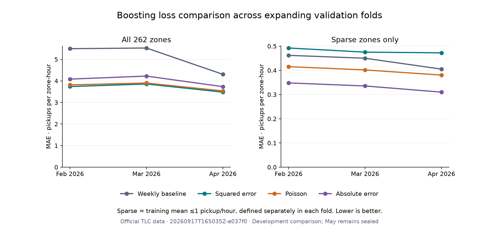

# Development walk-forward review · September 17, 2026

**Squared-error histogram boosting has the lowest overall MAE in all three validation months.** Its pooled MAE is 3.69295 versus 5.10423 for the strongest baseline, a 27.65% reduction. Poisson and absolute-error losses improve sparse-zone MAE in every fold, but increase overall MAE and RMSE. This is evidence of a real tradeoff, not a reason to automatically replace the current API model.

Run: `20260917T165035Z-e037f0`. The [protocol](../docs/WALK_FORWARD_PROTOCOL.md) and [configuration](../configs/walk_forward.toml) were committed in [`15db976`](https://github.com/gitLamHoang/nyc-mobility-intelligence/commit/15db9760a6fb0b74a0693d68f5e54ea55b4b4a0f) before implementation and execution. The study used official TLC observations and exactly the planned fifteen model fits, five baselines per fold, unchanged features and fixed hyperparameters. No date exclusions, tuning, rounding, zero threshold, reweighting or new features were introduced.

## Coverage and causal contract

Every model forecasts the same 262 zones and 559,370 nonoverlapping validation zone-hours. Dates below are NYC local, with end dates exclusive. The expanding training origin is December 1, 2025, and the initial 168 elapsed hours provide feature warm-up.

| Fold | Training targets after warm-up | Validation targets | Training rows | Validation hours | Validation rows |
|---|---|---|---:|---:|---:|
| February | Dec 8–Feb 1 | Feb 1–Mar 1 | 345,840 | 672 | 176,064 |
| March | Dec 8–Mar 1 | Mar 1–Apr 1 | 521,904 | 743 | 194,666 |
| April | Dec 8–Apr 1 | Apr 1–May 1 | 716,570 | 720 | 188,640 |

Every fold fits new estimators and preprocessing on its training rows only. Within validation, models remain fixed while lag features incorporate newly observed prior hours. This retains the assumption that complete previous-hour counts are available at the forecast boundary. March's 743 hours correctly account for spring daylight-saving time. All audited anomalous periods remain present.

The reader filters out May before feature construction. February and March had previously been used as training data, and April results had already been inspected. These are development folds; they are not three independent untouched test sets. Their training periods overlap. **No statistical significance or final-test claim is made.**

## Overall results

Metrics are recomputed from all concatenated out-of-fold predictions with equal weight per zone-hour. In particular, pooled RMSE and R² are not averages of monthly scores. SMAPE uses 200 × absolute error / (absolute actual + absolute prediction), with zero for the zero/zero case.

| Model | Pooled MAE | Pooled RMSE | Pooled R² | SMAPE % |
|---|---:|---:|---:|---:|
| Boosting · squared error | **3.69295** | **10.26719** | **0.96689** | 102.58 |
| Boosting · Poisson | 3.75193 | 10.99422 | 0.96203 | 102.02 |
| Boosting · absolute error | 4.01435 | 12.90600 | 0.94768 | 105.11 |
| Linear regression | 4.37308 | 12.13296 | 0.95376 | 76.44 |
| Ridge | 4.38066 | 12.13769 | 0.95372 | 77.29 |
| Previous week (168h) | 5.10423 | 16.26170 | 0.91694 | **60.55** |
| Previous hour | 5.61255 | 16.67647 | 0.91265 | 62.24 |
| Training zone/hour average | 6.58446 | 21.66461 | 0.85257 | 97.09 |
| Previous day (24h) | 6.75536 | 23.87775 | 0.82091 | 63.88 |
| Rolling 24h mean | 12.18516 | 35.50295 | 0.60408 | 99.34 |

| Model | February MAE | March MAE | April MAE |
|---|---:|---:|---:|
| Previous hour | 5.52696 | 5.71577 | 5.58593 |
| Previous day (24h) | 6.89346 | 7.04296 | 6.32966 |
| Previous week (168h) | 5.49402 | 5.52572 | 4.30547 |
| Training zone/hour average | 6.94785 | 6.67209 | 6.15486 |
| Rolling 24h mean | 11.89883 | 12.43076 | 12.19896 |
| Linear regression | 4.44634 | 4.52511 | 4.14782 |
| Ridge | 4.45687 | 4.53435 | 4.15092 |
| Boosting · squared error | **3.73887** | **3.85778** | **3.47999** |
| Boosting · Poisson | 3.81756 | 3.90159 | 3.53623 |
| Boosting · absolute error | 4.08374 | 4.22361 | 3.73363 |

The weekly baseline is the strongest baseline in each month. Compared with squared-error boosting, Poisson increases pooled MAE by 1.60% and RMSE by 7.08%; absolute-error loss increases them by 8.70% and 25.70%. These results apply to the fixed settings in this study, not every possible implementation or tuning of those losses.



## Sparse zones and the zero-demand tradeoff

A sparse zone has a mean of at most one pickup/hour in the current fold's training targets. There are 91 such zones in each fold. Cohorts are recomputed from training only; validation demand never determines sparse-zone membership.

| Model | Sparse February MAE | Sparse March MAE | Sparse April MAE |
|---|---:|---:|---:|
| Previous week (168h) | 0.46206 | 0.45009 | 0.40514 |
| Boosting · squared error | 0.49235 | 0.47525 | 0.47240 |
| Boosting · Poisson | 0.41527 | 0.40184 | 0.38042 |
| Boosting · absolute error | **0.34810** | **0.33553** | **0.31002** |

Squared-error boosting is worse than the weekly baseline on sparse-zone MAE in every fold, despite its overall lead. Absolute-error loss gives the smallest sparse-zone MAE among these four, while Poisson gives the smallest sparse-zone RMSE among them in all three months. In April those RMSE values are 0.78169 for squared error, 0.73745 for Poisson and 0.79531 for absolute error. Reducing typical absolute error does not necessarily reduce larger misses.

The cost is visible in Manhattan: April MAE rises from 9.33316 with squared-error loss to 9.66658 with Poisson and 10.43467 with absolute-error loss. The corresponding dense-zone MAEs are 5.08052, 5.21563 and 5.55555. Staten Island shows the opposite MAE pattern: 0.24074, 0.04725 and 0.02000, respectively. A citywide average therefore obscures meaningful geographic differences.

For April's 73,595 observed-zero targets:

| Model | Mean prediction / MAE | Strictly positive predictions | SMAPE % |
|---|---:|---:|---:|
| Previous week (168h) | 0.38965 | 23.627% | 47.25 |
| Boosting · squared error | 0.55048 | 99.986% | 199.97 |
| Boosting · Poisson | 0.47092 | 100.000% | 200.00 |
| Boosting · absolute error | 0.27501 | 95.581% | 191.16 |

The zero/positive grouping is a diagnostic based on realized targets, never an input feature. Every strictly positive prediction against an actual zero contributes 200% SMAPE regardless of magnitude. This explains why smaller false-positive counts do not necessarily improve SMAPE much. Absolute-error boosting's tiny positive Staten Island forecasts illustrate the issue: April mean prediction is 0.000329, but its SMAPE is 199.99%. R² is undefined for constant-target groups and is now recorded as null (blank in CSV); earlier immutable reports retain their historical metric implementation.

## Reproduction and verification

```bash
OMP_NUM_THREADS=4 OPENBLAS_NUM_THREADS=4 uv run nyc-mobility backtest
uv run python scripts/plot_backtest.py reports/backtests/<backtest-id>
uv run pytest
uv run ruff check .
uv run ruff format --check .
```

- [Immutable metrics and provenance](backtests/20260917T165035Z-e037f0/metrics.json): protocol, feature list, per-fold boundaries/counts, all hyperparameters, fitting times, source hashes, dependency-lock hash and canonical-data hash. The recorded Git revision is the prior protocol commit and the worktree was dirty because the runner was implemented afterward; source hashes identify the exact executed code.
- [Pooled scores](backtests/20260917T165035Z-e037f0/pooled_metrics.csv), [fold scores](backtests/20260917T165035Z-e037f0/fold_metrics.csv), [all prescribed slices](backtests/20260917T165035Z-e037f0/slice_metrics.csv) and [89 days of paired MAE summaries](backtests/20260917T165035Z-e037f0/daily_mae.csv) are published. The large per-target forecasts stay in ignored local Parquet files.
- [Verification evidence](backtests/20260917T165035Z-e037f0/verification.json): all eight original April candidates reproduce every metric exactly. Canonical data, serving model, metadata, original validation predictions, original experiment pointer and API smoke evidence are byte-for-byte unchanged. All twenty source hashes, the frozen protocol hash and the lockfile hash match the run.
- 59 behavioral tests pass, including DST coverage, refitting, training-only cohorts, pooled metric calculation, held-out-row exclusion and preservation of the existing serving state. Ruff lint/format checks pass. The real backtest and plotting script completed; the figure was visually inspected. Existing upstream dependency deprecation warnings remain documented.

## Decision and next study

Retain squared-error boosting as the development leader and keep the original serving artifact. This comparison does not solve sparse-zone overprediction. Record the alternative-loss result as a tradeoff rather than promoting a model solely because its objective appears better suited to counts.

Before expanding tuning or adding new model families, freeze a paired daily-block uncertainty analysis and an observation-latency sensitivity protocol. The stored daily summaries support the former; the latter must rebuild all demand-derived features at explicit availability lags rather than just shifting one input. Any subsequent model or feature comparison needs a recorded budget and temporal folds. May remains sealed for the single planned October evaluation after final model selection.
