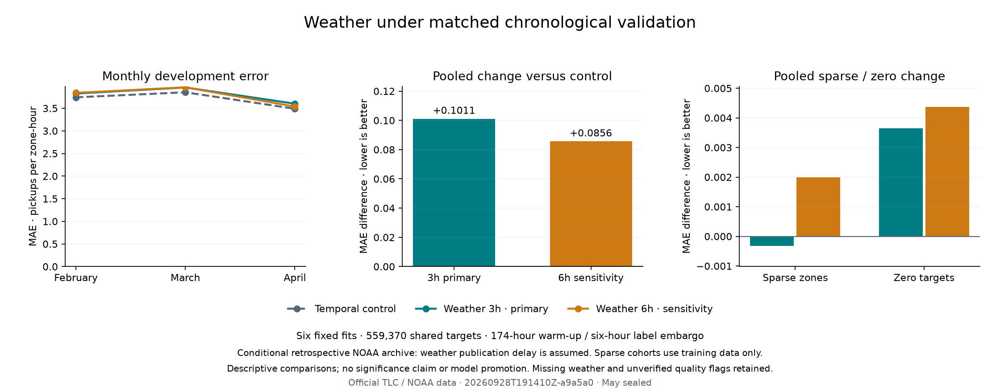

# Conditional weather ablation · September 28, 2026

Adding the frozen NOAA weather bundle **worsens pooled MAE by 2.735676% at the primary three-hour delay and 2.317405% at six hours**. Both candidates lose to the matched temporal control in every validation month and worsen pooled RMSE. The hypothesis that this fixed bundle improves aggregate forecasting fails on the observed development period. No model is promoted; May remains sealed.

The [protocol](../docs/WEATHER_ABLATION_PROTOCOL.md) was committed in `95439e9` before fitting. Run `20260928T191410Z-a9a5a0` uses exactly six fresh histogram fits, two declared weather delays and three expanding folds, with all **559,370 February–April zone-hours** retained. It compares the entire bundle, including quality/missingness indicators, under hypothetical archive availability. It does not isolate a causal weather effect or establish that weather cannot help another model.

## Measured results

Positive MAE change below means worse than the matched zero-delay temporal control. This is the 174-hour warm-up/six-hour label-embargo comparison, not the original April-only serving experiment.

| Model | Pooled MAE | MAE change vs temporal | RMSE | R² | SMAPE % |
|---|---:|---:|---:|---:|---:|
| Temporal control | 3.695750 | +0.000000% | 10.278490 | 0.966815 | 102.528315 |
| Weather 3h · primary | 3.796854 | +2.735676% | 10.682715 | 0.964154 | 102.552905 |
| Weather 6h · sensitivity | 3.781396 | +2.317405% | 10.613687 | 0.964615 | 102.571841 |

| Validation month | Temporal MAE | Weather 3h MAE | Weather 6h MAE |
|---|---:|---:|---:|
| February | 3.741904 | 3.825877 | 3.840910 |
| March | 3.853552 | 3.960150 | 3.963534 |
| April | 3.489830 | 3.601253 | 3.537893 |

The absolute pooled MAE increases are **0.101103751** and **0.085645491** pickups per zone-hour. Six-hour weather has lower pooled error than three-hour weather by 0.015458260, but is worse in February and March and better in April. This reversal does not justify relabeling the sensitivity as the primary candidate. These are descriptive point estimates; no weather uncertainty interval has yet been computed.



## Sparse demand and geographic tradeoffs

Sparse zones are defined from each fold's training mean (≤1 pickup/hour), with 91 zones per fold. Three-hour weather slightly improves sparse-zone MAE in February and March but worsens April. Six-hour weather improves March only. Both remain worse than the weekly baseline in every month:

| Month | Weekly baseline | Temporal | Weather 3h | Weather 6h |
|---|---:|---:|---:|---:|
| February | 0.462062 | 0.496590 | 0.488635 | 0.498617 |
| March | 0.450091 | 0.479521 | 0.473322 | 0.472642 |
| April | 0.405143 | 0.464560 | 0.477442 | 0.475689 |

Pooled sparse-zone MAE is 0.479848 for temporal, 0.479531 for three-hour weather and 0.481845 for six-hour weather, versus 0.438701 for weekly. The three-hour aggregate improvement is only 0.000317 and is not consistent across months.

Zero-target errors show a similar monthly reversal:

| Month | Weekly baseline | Temporal | Weather 3h | Weather 6h |
|---|---:|---:|---:|---:|
| February | 0.555571 | 0.616146 | 0.607877 | 0.621788 |
| March | 0.446240 | 0.572195 | 0.568238 | 0.559453 |
| April | 0.389646 | 0.550836 | 0.572563 | 0.571004 |

Pooled zero-target MAE worsens from 0.578297 to 0.581947 / 0.582663. Both weather variants worsen Manhattan and Queens MAE in every month; effects in other boroughs vary. All 888 borough, calendar, sparse/dense and zero/positive slices are published, including favorable subsets. The bundle does not resolve the persistent sparse/zero-demand weakness.

## Data, availability and fixed representation

The prior [NOAA source review](WEATHER_POLICY_REVIEW.md) admitted documented sources 412/413 with blank flags only as **unverified**. Their passed-check semantics and historical publication/revision availability remain unresolved; the original strict source-223 audit is preserved. April's complete weather snapshots rely on unverified readings. The source transition spans late March/April, so fold differences cannot be attributed solely to delay. Precipitation remains excluded.

For LaGuardia, JFK and Central Park, append temperature, dew point, wind speed, explicit missing and unverified flags, and observation age: 30 numeric columns. The latest eligible core observation must satisfy observation time + assumed delay < target time and a 12-hour age ceiling. Field gaps stay missing, with no fallback to an older field, imputation or weather-driven target deletion. Both bundles passed full-fold coverage checks before the first fit. The frozen weather policy, features and source files were not changed after observing scores.

All original 18 zone/temporal inputs stay identical. Each fit uses a new dense zone encoder and histogram estimator, with 120 iterations, learning rate 0.08, 31 leaves, L2=1, squared-error loss, 255 bins and seed 42; no early stopping. Actual transformed matrices are float64 with 309 columns. Recorded metadata includes resolved parameters, dtypes and full column order. Native missing-value handling retains every validation row.

Training expands from December with 174 hours of common warm-up and a six-hour training-label embargo: 342,696 / 518,760 / 713,426 rows. Validation has 176,064 / 194,666 / 188,640 rows, including March's 743 elapsed hours. Source hashes, original estimator source, training signatures, cohorts, validation keys/labels and all saved control scores match. Taxi counts still assume complete prior-hour observations; this experiment provides no live feed.

## Execution and verification

The six fit/predict operations total **119.051639291 seconds** locally with four OpenMP/BLAS threads. This excludes acquisition, preparation, preflight and report verification and is not a capacity benchmark. No replacement fits were attempted. Saved outputs contain eight pooled scores, 24 monthly scores, 12 contrasts, 888 slices and 712 daily/model errors across 89 NYC dates. Daily summaries include absolute-error totals and row counts for paired analysis. Full predictions remain ignored and no candidate model binary is published.

The [run record](weather_ablation/20260928T191410Z-a9a5a0/metrics.json) pins inputs, sources, frozen protocol, lock, forecast hashes and representations. Its dirty-worktree flag records implementation relative to the parent commit; exact source hashes identify what ran. The [independent verifier](weather_ablation/20260928T191410Z-a9a5a0/verification.json) checks all four pooled/fold metrics, every slice, daily weighted errors/DST counts, all contrasts, saved controls and the exact six-fit ledger. Maximum pooled/fold discrepancy is 1.4210854715202004e-14 and slice discrepancy is 2.842170943040401e-14. All **534 tests** and Ruff pass, including 47 new tests for frozen budgets, missing-value retention, control/input mutation, failure stopping and exact verification ledgers. Thirty-seven prior data/model/evidence/protocol files remain byte-identical. The figure was rendered and visually inspected.

To execute the study in a restored research environment:

```bash
OMP_NUM_THREADS=4 OPENBLAS_NUM_THREADS=4 uv run nyc-mobility weather-ablation
uv run python scripts/verify_weather_ablation.py reports/weather_ablation/<run-id>
uv run python scripts/plot_weather_ablation.py reports/weather_ablation/<run-id>
```

Exact fitting requires the pinned canonical panel, zone lookup, original ignored latency-control forecasts and cached NOAA archives/audit outputs. Mutable NOAA URLs may no longer return the pinned bytes. Changed or absent inputs fail before fitting, rather than silently reconstructing different controls. Portable control reconstruction remains a hardening item. The plot reproduces from tracked CSVs alone; the verifier uses ignored saved forecasts but fits nothing. Do not refit merely to redraw or summarize these results. A caught fit failure stops the budget and writes a failure ledger; an abrupt process kill can preclude that write and must never trigger an automatic retry.

## Decision and next action

Retain the negative result and both delay settings as development evidence. Keep the serving model unchanged, and do not expand tuning or claim a quality/publication issue caused the regression. Freeze the [paired weather uncertainty protocol](../docs/WEATHER_UNCERTAINTY_PROTOCOL.md) before resampling: both weather-versus-temporal contrasts, 10,000 paired circular-day draws at 7/1/14-day blocks and a two-contrast nominal family correction. Execute from tracked daily summaries without models or taxi targets, then proceed to interpretation and reproducibility hardening. No uncertainty draws were made today. May remains sealed until the October final freeze.
