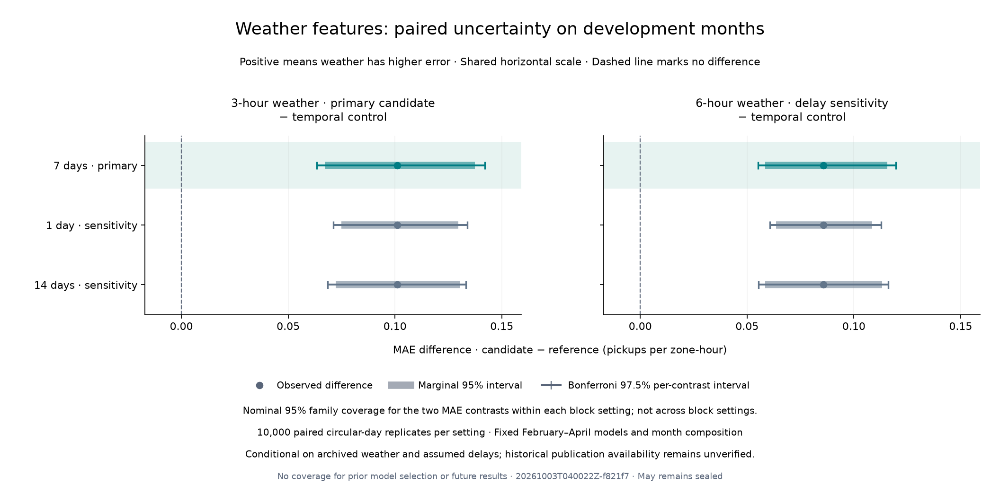

# Weather uncertainty review · October 2, 2026

Both fixed weather bundles retain higher aggregate error than the temporal control under every declared block setting. The primary three-hour candidate's adjusted MAE-difference interval is **[+0.063437, +0.142011]**; the six-hour sensitivity is **[+0.055109, +0.119552]**. All endpoints remain positive at one-, seven- and fourteen-day blocks. Keep the serving model unchanged and retain this negative result as evidence about the tested bundle.

## Fixed follow-up

The [protocol](../docs/WEATHER_UNCERTAINTY_PROTOCOL.md) and [configuration](../configs/weather_uncertainty.toml) were committed in `4ba1b30` before resampling. The earlier point estimates were already known. Run [`20261003T040022Z-f821f7`](weather_uncertainty/20261003T040022Z-f821f7/metrics.json) reads only the two pinned, tracked summaries from the [six-fit weather study](WEATHER_ABLATION_REVIEW.md). They contain **712 daily/model records, eight models, 89 NYC dates and 559,370 February–April zone-hours per model**. No models were fitted or target tables loaded.

The same sampled dates are shared across all models inside each monthly fold. Each block setting has 10,000 circular-day replicates, seed 42 and actual row weights: March 8 contributes 6,026 zone-hours rather than the ordinary 6,288. The three-hour candidate remains primary; six hours remains a delay sensitivity, irrespective of ranking. The direct six-minus-three comparison is not part of this inferential family.

## Results and limits

Positive differences mean higher candidate MAE, in pickups per zone-hour. Absolute intervals use Bonferroni allocation across the **two predeclared contrasts**: 97.5% per-contrast intervals (tails 0.0125/0.9875), for nominal 95% family coverage within a single block setting.

| Contrast | Observed MAE difference | Primary adjusted interval | Observed MAE increase |
|---|---:|---:|---:|
| Weather 3h − temporal | +0.101104 | [+0.063437, +0.142011] | 2.735676% |
| Weather 6h − temporal | +0.085645 | [+0.055109, +0.119552] | 2.317405% |

The primary marginal 95% relative-**reduction** intervals are [−3.709385%, −1.822305%] and [−3.118090%, −1.587855%], respectively. Their negative signs indicate worse error. These relative intervals are separate from the adjusted absolute-difference family.

| Block days | Candidate | Adjusted absolute-MAE interval |
|---|---|---:|
| 7 | weather_3h | [+0.063437, +0.142011] |
| 7 | weather_6h | [+0.055109, +0.119552] |
| 1 | weather_3h | [+0.071157, +0.133940] |
| 1 | weather_6h | [+0.060738, +0.112821] |
| 14 | weather_3h | [+0.068489, +0.133308] |
| 14 | weather_6h | [+0.055441, +0.116190] |

The [full table](weather_uncertainty/20261003T040022Z-f821f7/comparison.csv) retains all six comparisons, full-precision values and interval definitions. Seven days is the predeclared primary block length. The original aggregate-improvement hypothesis remains unsupported: weather increased pooled MAE by 2.735676% / 2.317405% and worsened pooled RMSE from 10.278490 to 10.682715 / 10.613687. Both candidates lose to the temporal control on monthly MAE and to the weekly baseline on sparse-zone MAE in every month. Minor sparse improvements in some months do not establish a general subgroup benefit.



These intervals condition on fixed fitted models, the observed development months, the declared quality policy and assumed observation delays. NOAA sources 412/413 still lack verified passed-check semantics; historical publication/revision availability is unverified. The result concerns the whole weather/missingness/quality bundle and cannot attribute the regression to a particular variable or prove that weather is inherently unhelpful.

Short monthly strata, artificial circular wraparound, omitted cross-month dependence and earlier development selection limit coverage. Bonferroni allocation does not repair bootstrap calibration or cover all previous experiments, all block settings, relative metrics, future months or individual forecasts. No causal, operational-availability or future-superiority claim follows. May remains sealed.

## Reproduction and verification

This analysis runs from a fresh checkout and the locked Python environment, without raw trips, archived station tables, original models or ignored forecast tables:

```bash
uv sync --frozen --python 3.12
uv run nyc-mobility weather-uncertainty
uv run python scripts/verify_weather_uncertainty.py reports/weather_uncertainty/<run-id>
uv run python scripts/plot_weather_uncertainty.py reports/weather_uncertainty/<run-id>
```

The analysis produces ignored paired draw arrays needed by the verifier. The plot uses tracked reports alone. The runner checks all frozen settings, model/fold/date coverage, DST weights, finite daily error totals and pooled/fold reconciliation. Protocol, protocol-document, input, source and lock hashes are checked before and after sampling; altered evidence prevents publication. The shared resampling arithmetic and prior analyses are unchanged.

The [independent verifier](weather_uncertainty/20261003T040022Z-f821f7/verification.json) checks all 712 daily summaries and independently computes linear percentiles by sorting and interpolating saved draws. Maximum endpoint discrepancy is `4.440892098500626e-16`. A temporary directory containing only source, configs, protocol document, lock and the two tracked summaries reproduced every draw array exactly and the comparison CSV byte-for-byte. All **50 preserved data/model/evidence/protocol/demo files** are unchanged; hashing file bytes does not evaluate held-out targets.

All **580 tests** and Ruff pass, including 46 new tests for frozen settings, pairing, deterministic reproduction, absolute totals, DST coverage, no-fit/no-target access and mid-run provenance mutation. The real analysis, verifier and visually inspected plot pass. No dependencies were added. The executed source hashes identify the intentional dirty worktree relative to `4ba1b30`.

## Next action

Stop extending this weather search on the basis of development scores. Next create reproducible forecast diagnostics and a concise model card from existing development evidence, with training-defined sparse cohorts, borough/hour failure patterns and explicit availability limits. Any feature-importance experiment should first declare a temporal perturbation design. Then finish clean-install packaging and monitoring before the October 11 model freeze. No additional fits or May access are needed to explain the current results.
