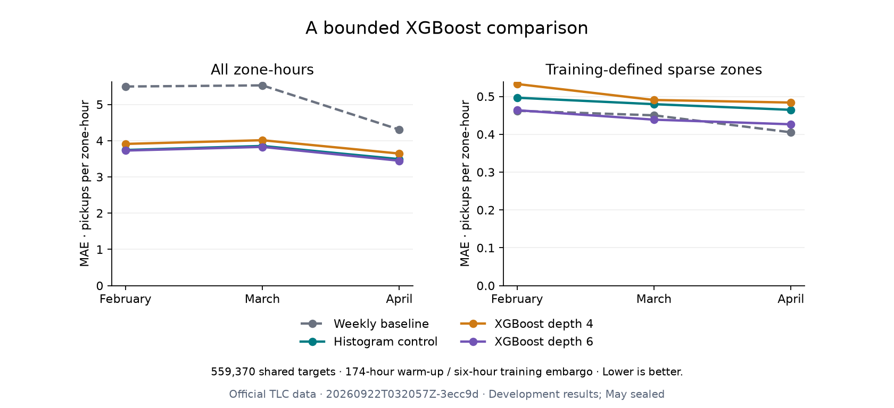

# Bounded XGBoost comparison · September 21, 2026

Depth-6 XGBoost reduces pooled development MAE **0.76422%** against the matched
histogram-boosting control, but slightly worsens RMSE. Depth 4 worsens both metrics.
This small observed gain is a candidate for paired uncertainty analysis, not
established superiority or a serving-model promotion. May remains sealed.

## Frozen design and verified coverage

The [protocol](../docs/XGBOOST_PROTOCOL.md) and [TOML](../configs/xgboost.toml) were
committed and pushed in `9a9d282` before dependency installation or fitting.
Run `20260922T032057Z-3ecc9d` uses a UTC identifier; execution was September 21
America/Los_Angeles. Exactly **six fits**: depths 4 and 6 over expanding February,
March and April folds. No extra settings, early stopping, or search expansion.

Use the zero-delay latency study's **174-hour warm-up and six-hour training
embargo**. Training rows are 342,696 / 518,760 / 713,426; validation rows are
176,064 / 194,666 / 188,640. Both candidates and all six saved controls share
**559,370 targets** across 262 zones. Each fold has 91 sparse zones, classified
using its training counts only. March has 743 hours, including the DST transition.
Do not compare these scores as if training matched the original 168-hour backtest.

The runner pins the canonical panel, control report and three prediction-file
hashes, verifies the unchanged temporal feature builder, then checks every fold's
training signature, boundaries, keys, labels, cohorts and recomputed control
metrics before fitting. Dense float32 one-hot zone encoding preserves real zeros.
All 18 inputs are unchanged; no weather or spatial features are added. The model
only uses completed history through t−1, with no validation evaluation set.

## All pooled results

| Candidate | MAE | RMSE | R² | SMAPE % |
|---|---:|---:|---:|---:|
| Latest available hour | 5.612555 | 16.676471 | 0.912645 | 62.241636 |
| Previous day | 6.755355 | 23.877751 | 0.820911 | 63.881264 |
| Previous week | 5.104228 | 16.261698 | 0.916936 | 60.553689 |
| Training zone/hour mean | 6.587910 | 21.662714 | 0.852597 | 97.085927 |
| Trailing 24-hour mean | 12.185161 | 35.502945 | 0.604078 | 99.336486 |
| Histogram control | 3.695750 | **10.278490** | **0.966815** | 102.528315 |
| XGBoost depth 4 | 3.855672 | 10.930036 | 0.962475 | 102.406473 |
| XGBoost depth 6 | **3.667507** | 10.334616 | 0.966452 | 100.395905 |

Depth 6 changes MAE by **−0.028244 pickups per zone-hour** versus histogram
boosting (0.76422% lower), and is 28.14767% below weekly. Its pooled RMSE rises
from 10.278490 to 10.334616, indicating a different tradeoff in larger errors.
Depth 4 increases control MAE **4.32719%**. The hypothesis that the shallower
candidate improves this control failed at the frozen budget.

| Validation month | Weekly MAE | Histogram MAE | XGBoost depth 4 | XGBoost depth 6 |
|---|---:|---:|---:|---:|
| February | 5.494019 | 3.741904 | 3.909866 | 3.726816 |
| March | 5.525716 | 3.853552 | 4.012249 | 3.827876 |
| April | 4.305471 | 3.489830 | 3.643514 | 3.446659 |

Depth 6 has lower aggregate MAE in all three months. This does not make the
comparison an untouched test: these development periods have been inspected
repeatedly, and depth 6 was selected from two candidates. No uncertainty interval
has yet been computed for either new contrast. The previously published
histogram-versus-weekly intervals do not transfer to this comparison.

## Sparse and zero-demand behavior

| Sparse-zone MAE | Weekly | Histogram | XGBoost depth 4 | XGBoost depth 6 |
|---|---:|---:|---:|---:|
| February | 0.462062 | 0.496590 | 0.532818 | 0.463547 |
| March | 0.450091 | 0.479521 | 0.490608 | 0.438610 |
| April | 0.405143 | 0.464560 | 0.483820 | 0.426395 |

Depth 6 improves sparse MAE against histogram boosting in every fold but still
loses to weekly in February and April. At truly zero-demand hours, depth-6 MAE
is 0.593962 / 0.537863 / 0.521506, better than the control's
0.616146 / 0.572195 / 0.550836 but worse than weekly's
0.555571 / 0.446240 / 0.389646. Overall SMAPE remains much worse than weekly.
The sparse/zero-demand weakness is reduced, not resolved.



## Reproduction and audit

```bash
# macOS prerequisite for the published XGBoost wheel:
brew install libomp
uv sync --frozen --python 3.12
# Requires prepared official data AND the pinned source-control artifacts below:
OMP_NUM_THREADS=4 OPENBLAS_NUM_THREADS=4 uv run nyc-mobility xgboost
uv run python scripts/plot_xgboost.py reports/xgboost/<xgboost-id>
```

Python 3.12.13, XGBoost 3.4.1, scikit-learn 1.9.1, pandas 2.3.3 and NumPy 2.5.3
were used. All pre-existing locked versions are unchanged. Platform markers use
the regular macOS wheel and the CPU-only Linux/Windows distribution. The first
local import failed because libomp was absent; installing libomp 23.1.0 resolved
it before testing or real fitting. No parameter or fit-budget change was needed.

Parameter provenance captures the sklearn constructor values. Library-selected
defaults and the fitted native base score were not materialized in the report;
this falls short of the protocol's full resolved-parameter record. The pinned
version and explicit study settings identify the run, but future fitting runners
should export the native booster configuration while it is in memory. No extra
fits were spent to fill this metadata gap.

**Fresh-checkout prerequisite:** predictions are intentionally excluded from Git.
The default protocol requires the original three `delay_0_fold_*.parquet` files
under `artifacts/latency/20260921T021023Z-588968/`, with the hashes in the TOML.
The source metrics are already tracked. Restore those cached files, or reproduce
the historical latency stage in its locked environment and verify the three
zero-delay outputs against the pinned hashes before placing them in that folder.
Different platforms may not reproduce identical model predictions/Parquet bytes;
the runner refuses mismatches. Do not silently rewrite the pinned control to
accept a different run. Portable control reconstruction remains a reproducibility
hardening item; the published small metric tables and figure can be inspected
without private data or model files. Regenerating the figure needs only Git files.

The six new fits plus predictions took **18.522615 seconds** in this local run;
that excludes loading, validation and reporting, and is not a controlled speed
benchmark against previously timed models. No controls were refitted. Saved
outputs contain eight pooled scores, 24 fold scores, 888 slice rows and 712 daily
model errors (89 days × eight models). Recomputed pooled scores match exactly;
weighted daily MAE reconciles, including 6,026 rows/model on March 8.

[Verification](xgboost/20260922T032057Z-3ecc9d/verification.json) confirms nine
unchanged canonical-data/serving/evidence files. The temporal builder and original
serving estimator factory are unchanged. The executed runner's source hashes and
new lock hash identify the intentionally dirty implementation worktree rooted
at the protocol commit. All **118 tests**, Ruff checks, the real six-fit stage and
saved-metric plotting passed; the figure was visually inspected. Raw data,
prediction tables, model binaries and the environment remain ignored.

Full precision: [metrics and provenance](xgboost/20260922T032057Z-3ecc9d/metrics.json),
[fold metrics](xgboost/20260922T032057Z-3ecc9d/fold_metrics.csv),
[slice diagnostics](xgboost/20260922T032057Z-3ecc9d/slice_metrics.csv),
and [daily paired errors](xgboost/20260922T032057Z-3ecc9d/daily_mae.csv).

## Decision and next action

Keep the serving model unchanged. Next freeze a paired day-block uncertainty
protocol using these saved daily errors, covering **both** XGBoost-versus-control
contrasts and the predeclared seven-day primary / one- and fourteen-day sensitivity
lengths. Account explicitly for comparing two candidates; retain the caveat that
these folds have been reused. No new fits are needed. Then progress to precommitted
spatial ablations rather than expanding this search based on a small gain.
Observation availability is still hypothetical for a live application; this study
adds neither a timely feed nor an XGBoost latency experiment. May stays sealed.

### September 22 follow-up

The [paired uncertainty analysis](XGBOOST_UNCERTAINTY_REVIEW.md) is now complete.
Depth 6's primary adjusted absolute-MAE interval is [−0.042128, −0.014221]; the
small observed gain remains directional under all declared block lengths, with
explicit limits on conditional coverage and repeated model selection. The RMSE
tradeoff remains and the serving model is unchanged.
