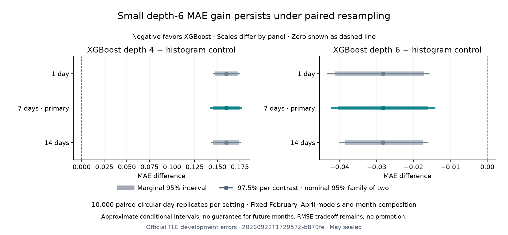

# Paired XGBoost uncertainty · September 22, 2026

Depth 6's small observed MAE gain survives the declared paired resampling and
two-comparison adjustment: the primary MAE difference is **−0.028244 pickups per
zone-hour**, with adjusted interval **[−0.042128, −0.014221]**. Depth 4 remains worse.
Both directions persist at all three block lengths. These conditional development
intervals do not establish future performance or justify automatic promotion;
the previously measured RMSE and sparse-demand tradeoffs remain.

## Precommitted analysis

The [protocol](../docs/XGBOOST_UNCERTAINTY_PROTOCOL.md) and
[configuration](../configs/xgboost_uncertainty.toml) were committed and pushed in
`fccf7b4` before resampling. Inputs are hash-pinned `metrics.json` and `daily_mae.csv`
from XGBoost run `20260922T032057Z-3ecc9d`: **712 daily/model summaries**, 89 NYC
dates, eight models and **559,370 validation zone-hours per model**. No model was
refitted, and no trip, target/forecast Parquet or serving artifact was loaded.
May remains sealed.

Run **`20260922T172957Z-b879fe`** uses 10,000 paired circular-day bootstrap draws
per block setting. Seven days is primary; one and fourteen are fixed sensitivities.
All models share sampled days within each fold. February/March/April strata are
sampled independently; pooled errors use actual row weights, including 6,026
zone-hours on the 23-hour March 8 day. The source forecast contract remains
174-hour warm-up, six-hour training embargo, and zero additional observation delay.

The primary family consists of **two absolute MAE differences**: each XGBoost
depth minus the matched histogram control. Nominal 95% family confidence allocates
alpha/2 to each contrast, giving **97.5% individual percentile intervals**
(1.25th/98.75th percentiles). Marginal 95% absolute and relative intervals are also
reported. Relative intervals are descriptive and are not family-adjusted.

## Measured results

Negative differences favor XGBoost. Each adjusted interval below accounts for the
two absolute-MAE contrasts within that block setting; there is no joint coverage
claim across all three settings.

| Block length | Depth | MAE difference | Marginal 95% interval | Adjusted interval: 97.5% per contrast |
|---|---:|---:|---:|---:|
| **7 days · primary** | 4 | +0.159922 | [0.144947, 0.174631] | **[0.142768, 0.176634]** |
| **7 days · primary** | 6 | −0.028244 | [−0.040447, −0.016074] | **[−0.042128, −0.014221]** |
| 1 day | 4 | +0.159922 | [0.147719, 0.172788] | [0.145973, 0.174624] |
| 1 day | 6 | −0.028244 | [−0.041146, −0.017110] | [−0.043261, −0.015790] |
| 14 days | 4 | +0.159922 | [0.145722, 0.174209] | [0.143835, 0.175920] |
| 14 days | 6 | −0.028244 | [−0.038617, −0.017431] | [−0.039898, −0.016135] |

The depth-6 point estimate is a **0.764217% relative MAE reduction**; its primary
**marginal** 95% relative interval is **[0.430015%, 1.102886%]**. Depth 4's relative
reduction is −4.327191%, with marginal interval [−4.706341%, −3.951145%]. Thus,
its MAE is worse under the primary analysis and both sensitivities. Reporting only
the selected depth-6 candidate would have hidden the failed shallower candidate.

Longer blocks need not widen intervals in these short monthly samples. All
predeclared block settings are reported; none was selected for a favorable result.
The two-contrast adjustment did not erase depth 6's small observed MAE advantage.
That result does not resolve the other metric tradeoffs: pooled RMSE was
**10.334616** for depth 6 versus **10.278490** for histogram boosting. Depth 6 still
lost to weekly on sparse-zone MAE in February/April and on zero-target MAE in all
three months. Those are point-estimate diagnostics, not new interval claims.



## What the intervals mean

The [Bonferroni union-bound rationale](https://itl.nist.gov/div898/handbook/prc/section4/prc473.htm)
allocates nominal error across the two chosen contrasts. It does not make
approximate bootstrap intervals exact. Coverage depends on how well the paired
block approximation describes these fixed models and this month composition.
The monthly strata contain only 28–31 days; circular wrapping creates artificial
end-to-start adjacency, and independent strata omit cross-month dependence.
[The circular-block method](https://arch.readthedocs.io/en/stable/bootstrap/timeseries-bootstraps.html)
retains local day dependence but does not validate those assumptions for NYC taxis.

These are neither prediction intervals nor probabilities that a candidate is
best. The correction covers these two contrasts only. It does not account for
previous model/loss experiments, repeated inspection of development months,
training uncertainty, later tuning, other seasons, source revisions or feed
latency. The nominal family statement applies to the primary MAE-difference
family; relative statistics and sensitivity settings are not jointly covered.
No unqualified significance or future-performance claim is warranted.

## Reproduce and verify

From the repository with its locked Python environment:

```bash
uv sync --frozen --python 3.12
uv run nyc-mobility xgboost-uncertainty
uv run python scripts/plot_xgboost_uncertainty.py reports/xgboost_uncertainty/<uncertainty-id>
```

This command requires only tracked summaries, configuration and source. It does
not require the ignored prediction files needed to repeat the underlying XGBoost
fits. It reuses the unchanged tested resampling/alignment functions; the original
uncertainty command and report pointer are preserved. New output is isolated under
`reports/xgboost_uncertainty/`, with draw arrays under ignored
`artifacts/xgboost_uncertainty/`.

All **137 tests**, Ruff lint/format, the actual stage and saved-metric plot pass.
New tests cover both-candidate family membership, exact percentile arithmetic,
relative-versus-family scope, forbidden model fitting/loading, held-out/missing
inputs, preflight failures and protocol mutation. The final figure was visually
inspected after correcting a clipped axis label.

An isolated-directory reproduction containing only the tracked source inputs,
configuration, lock and source tree produced **identical comparison rows and all
30,000 eight-model draw vectors**, with no data directory or pre-existing
artifacts. It used the same locked Python environment; this is not a separate
fresh-environment-install claim. Eleven existing data/model/evidence/lock files
remain byte-identical. Source, input, protocol, lock and saved-draw hashes match.
Independent literal-quantile recomputation differs at most
**6.94 × 10⁻¹⁸** from alpha-derived endpoints, below the recorded 10⁻¹⁴ audit
tolerance. No dependency versions changed.

Full precision: [metrics/provenance](xgboost_uncertainty/20260922T172957Z-b879fe/metrics.json),
[all comparison rows](xgboost_uncertainty/20260922T172957Z-b879fe/comparison.csv),
and [verification](xgboost_uncertainty/20260922T172957Z-b879fe/verification.json).
The executed worktree is identified by its source hashes and protocol-commit
parent; the dirty-worktree flag reflects implementation before publication.

## Decision and next action

Retain depth 6 as a development candidate with a small MAE advantage and a worse
RMSE point estimate. Keep the original serving model unchanged. Close this
six-fit tuning/uncertainty milestone without adding candidates or revisiting May.

Next audit the cached official Taxi Zone geometry and define a bounded spatial
ablation: static geographic context and strictly lagged neighbor/borough demand,
with missing-neighbor handling, matched training/validation coverage and explicit
availability tests. Freeze the feature bundles, control choice and fit budget
before fitting. Portable control reconstruction and native fitted-parameter
capture remain later hardening tasks; no additional fits are justified merely
to repair historical metadata.
